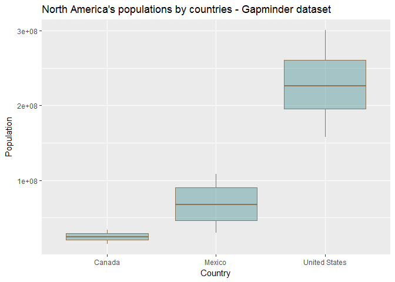

# hw-02
Melanie Ang  
September 24, 2017  

## Homework 2:
Where we explore the gapminder dataset and use dplyr and ggplot2!
Please see my **tips** sprinkled through the document for fun things I've learned in the process of completing this homework assignment such as colour customization, adding graph titles, axis etc. - read on! :)

### Install gapminder and tidyverse packages

```r
install.packages("gapminder")
library(gapminder)
```


```r
install.packages("tidyverse")
library(tidyverse)
```

**Tip 1: To keep neat and tidy rmarkdown, add {r Install gapminder, results='hide', message = FALSE, warning = FALSE} to run the code but surpress the results and warning messages!**

### Exploring the gapminder dataset


```r
typeof(gapminder) # its a list
class(gapminder) # its a data frame
summary(gapminder) # it has 6 variables/columns
ncol(gapminder) # this also gives number of coumn
dim(gapminder) # it has 1704 rows
str(gapminder) # country: factor, continent: factor, year: integer, lifeExp: number, pop: integer, gdppercap: number

# In the above code chunk, I have turn results = 'hide' to keep the code neat and not display the results. See comments and below for answers.
```

#### Answers to questions:
* Is it a data.frame, a matrix, a vector, a list?
    + list
* What’s its class?
    + data frame
* How many variables/columns?
    + 6 variables/columns  
* How many rows/observations?
    + 1704 rows/observations
* Can you get these facts about “extent” or “size” in more than one way? Can you imagine different functions being useful in different contexts?
    + Yes, you can get information about size or extent from dim() or str()
    + dim() would give you information about size of dataframes
    + str() in addition to extent information, could also inform of the class of object and the data type of each column
* What data type is each variable?
    + country: factor
    + continent: factor
    + year: integer
    + lifeExp: number
    + pop: integer
    + gdppercap: number

## Exploring individual variables

### Categorical variables: country and continent

```r
# Country
# I'm using the head function just to keep things neat and tidy, to not list all 142 countries!
head(unique(gapminder$country)) # there are 142 different unique countries
```

```
## [1] Afghanistan Albania     Algeria     Angola      Argentina   Australia  
## 142 Levels: Afghanistan Albania Algeria Angola Argentina ... Zimbabwe
```

```r
# Continent
unique(gapminder$continent) # 5 continents (Asia, Europe, Africa, America, Oceania)
```

```
## [1] Asia     Europe   Africa   Americas Oceania 
## Levels: Africa Americas Asia Europe Oceania
```

## Quantitative variable : pop and year
I have selected 2 quantitative variables to evaluate! Population and year. Again, I have hidden the output of these code below (eval = FALSE) because it is very long, please see comments within for answers.


```r
# POPULATION
unique(gapminder$pop) # displays the possible values
median(gapminder$pop) #7,023,596
range(gapminder$pop) # returns the range 60,011 to 1,318,683,096
```

Summary function returns the same results as running median and range etc separately and it displays it nicely in summary table!

```r
# YEAR
summary(gapminder$year)
```

```
##    Min. 1st Qu.  Median    Mean 3rd Qu.    Max. 
##    1952    1966    1980    1980    1993    2007
```

## Explore plot types

It's plotting time! I love graphing, mostly for the customization features of ggplot. First up, let's do a scatterplot using year and population!

### Scatterplot with 2 quantitative


```r
ggplot(gapminder, 
      aes(x=year, y=pop)) +
      geom_point(size = 1.5, color = "cornflowerblue") + # customization
      ggtitle("Gapminder dataset - \nPopulation vs. Year")
```

<!-- -->

**Tip 2: To add title, layer this onto your ggplot: "+ ggtitle("Gapminder dataset - Population vs. Year")"**

### Plot quantitative variable - continent (histogram)


```r
ggplot(data = gapminder, aes(gapminder$continent)) + 
  geom_histogram(stat = "count", colour = "black", fill = "coral2", alpha = 0.2) +
  labs(x = "Continent", y = "Count") + # relabel axis 
  ggtitle("Histogram of Continents in Gapminder dataset")
```

<!-- -->
**Tip 3: Do you like pretty colours like I do? Want to customize your graphs? Not just regular, boring blue but meet cornflower blue. To find a list of preset colours in R click [here](http://www.stat.columbia.edu/~tzheng/files/Rcolor.pdf). You can also specify HEX colours by including them with a hashtag "#FFFFFF"**


### Plot of pop vs. country (without subset)

```r
ggplot(gapminder,
      aes(x = country, y = pop)) +
      geom_boxplot()
```

<!-- -->

```r
# This displays all the countries in the gapminder dataset, which is obviously too many to effectively display in boxplots. In the following step, I use the filter function to subset the data to plot
```

### Use filter() to subset the above dataset


```r
NAmericas <- filter(gapminder, country == c("Canada", "Mexico", "United States"))
ggplot(NAmericas,
      aes(x=country, y=pop)) +
      geom_boxplot(colour = "burlywood4", fill = "cadetblue", alpha = 0.5) + #making pretty graphs via fill, line and transparency customization
      ggtitle("North America's populations by countries - Gapminder dataset") +
      labs(x = "Country", y = "Population")
```

<!-- -->

**Tip 3: Relabel axis by adding "labs(x = "insert_text_here", y = "insert_text_here"), insert your own x and y labels**


