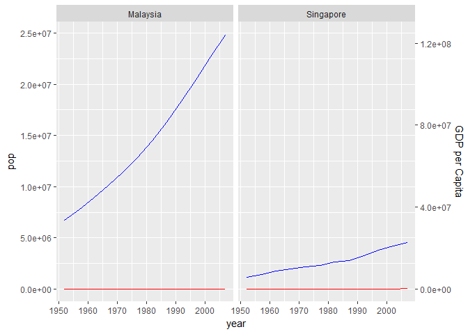
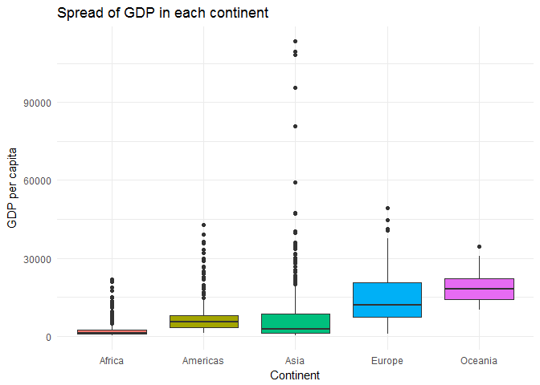
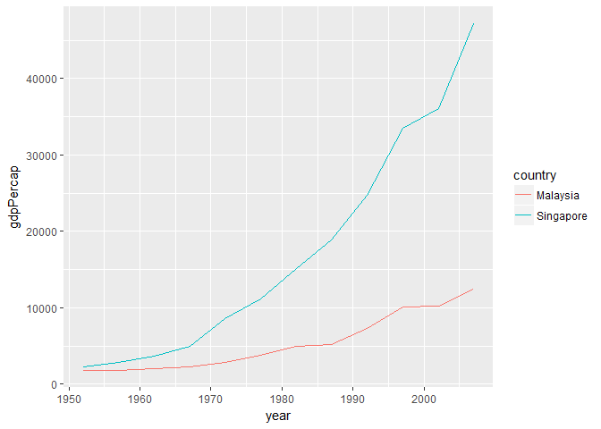

# hw-03
Melanie Ang  
September 27, 2017  

# Homework 3
In this homework, I experiment with dplyr (to manipulate data) and ggplot (to visualize data). Click [here](http://stat545.com/hw03_dplyr-and-more-ggplot2.html) to see the assignment on the STAT545 homework on web.

Again, check out the **tips** sprinkled through the documents for some of the things I've learned in this process of completing hwk-03.

### Step 1: Download packages

```r
library(gapminder) # our data set
library(tidyverse) # dplyr and ggplot2

# for kable
library(knitr)
devtools::install_github("haozhu233/kableExtra")
library(kableExtra)
```

### Task menu
I've picked four task from the selection on the [task section of the website](http://stat545.com/hw03_dplyr-and-more-ggplot2.html#task-menu) 

**1. Get the maximum and minimum of GDP per capita for all continents.**


```r
# Display in table
# Use dplyr functions to select, group by, summarize and display in kable

gapminder %>%
  select(continent, gdpPercap) %>%  # subset only relevant columns so its neater
  group_by(continent) %>%           # group according to continents
  summarize(min_gdppercap=min(gdpPercap), 
            max_gdppercap=max(gdpPercap)) %>% 
  knitr::kable(format = "markdown")                    # display in kable
```


|continent | min_gdppercap| max_gdppercap|
|:---------|-------------:|-------------:|
|Africa    |      241.1659|      21951.21|
|Americas  |     1201.6372|      42951.65|
|Asia      |      331.0000|     113523.13|
|Europe    |      973.5332|      49357.19|
|Oceania   |    10039.5956|      34435.37|

```r
#Plot it!

# There are multiple ways to do this. I could pipe contents into a ggplot for example. In this case, I chose to store value in a variable and call that variable later
p <- gapminder %>%
  select(continent, gdpPercap) %>%  # subset only relevant columns so its neater
  group_by(continent) %>%           # group according to continents
  summarize(min_gdppercap = min(gdpPercap), 
            max_gdppercap = max(gdpPercap)) 

# testing by displaying just minimum 
ggplot(p, aes(x=continent, y=min_gdppercap)) +
  geom_point()
```

<!-- -->

```r
# Display both minimum and maximum using geom_point
ggplot(p, aes(x=continent)) +
  geom_point(aes(y=min_gdppercap), colour = "blue") +
  geom_point(aes(y=max_gdppercap), colour = "red") +
  labs(y = "GDP per Cap") +
  theme_bw()
```

<!-- -->

```r
# I could get fancy here and customize the plot - one of the things I love about ggplot!
```

**Tip 1: Further customization of your ggplots using ggthemes!**
I love customizing with colours and fonts etc. 
There are some prebuilt ggplot2 themes. [Click here](http://ggplot2.tidyverse.org/reference/ggtheme.html)
You can also use the ggthemes package for additional themes. Check out the [ggtheme](https://github.com/jrnold/ggthemes) github for info on more pre-built themes.


```r
library(ggthemes)
```

```
## Warning: package 'ggthemes' was built under R version 3.3.2
```

```r
q <- ggplot(p, aes(x=continent)) +
  geom_point(aes(y=min_gdppercap)) +
  geom_point(aes(y=max_gdppercap)) +
  labs(y = "GDP per Cap")

q + theme_economist() #ggthemes
```

<!-- -->

```r
q + theme_dark() #ggplot2
```

<!-- -->


**2. Look at the spread of GDP per capita within the continents** 
Within spread, I chose to look at mean, standard deviation and median

**Tip 2: Further customization of kable tables**


```r
spread <- gapminder %>%
  group_by(continent) %>% 
  summarize(mean_gdp = mean(gdpPercap), 
            sd_gdp = sd(gdpPercap), 
            median_gdp = median(gdpPercap),
            max_gdp = max(gdpPercap),
            min_gdp = min(gdpPercap))

spread %>%
  kable(format = "html", 
  col.names = c("Continent", "Mean GDP", "Standard Deviation", "Median", "Maximum", "Minimum"), 
  caption = "Spread of GDP within continents of the Gapminder dataset") %>%
  kable_styling()
```

<table class="table" style="margin-left: auto; margin-right: auto;">
<caption>Spread of GDP within continents of the Gapminder dataset</caption>
 <thead><tr>
<th style="text-align:left;"> Continent </th>
   <th style="text-align:right;"> Mean GDP </th>
   <th style="text-align:right;"> Standard Deviation </th>
   <th style="text-align:right;"> Median </th>
   <th style="text-align:right;"> Maximum </th>
   <th style="text-align:right;"> Minimum </th>
  </tr></thead>
<tbody>
<tr>
<td style="text-align:left;"> Africa </td>
   <td style="text-align:right;"> 2193.755 </td>
   <td style="text-align:right;"> 2827.930 </td>
   <td style="text-align:right;"> 1192.138 </td>
   <td style="text-align:right;"> 21951.21 </td>
   <td style="text-align:right;"> 241.1659 </td>
  </tr>
<tr>
<td style="text-align:left;"> Americas </td>
   <td style="text-align:right;"> 7136.110 </td>
   <td style="text-align:right;"> 6396.764 </td>
   <td style="text-align:right;"> 5465.510 </td>
   <td style="text-align:right;"> 42951.65 </td>
   <td style="text-align:right;"> 1201.6372 </td>
  </tr>
<tr>
<td style="text-align:left;"> Asia </td>
   <td style="text-align:right;"> 7902.150 </td>
   <td style="text-align:right;"> 14045.373 </td>
   <td style="text-align:right;"> 2646.787 </td>
   <td style="text-align:right;"> 113523.13 </td>
   <td style="text-align:right;"> 331.0000 </td>
  </tr>
<tr>
<td style="text-align:left;"> Europe </td>
   <td style="text-align:right;"> 14469.476 </td>
   <td style="text-align:right;"> 9355.213 </td>
   <td style="text-align:right;"> 12081.749 </td>
   <td style="text-align:right;"> 49357.19 </td>
   <td style="text-align:right;"> 973.5332 </td>
  </tr>
<tr>
<td style="text-align:left;"> Oceania </td>
   <td style="text-align:right;"> 18621.609 </td>
   <td style="text-align:right;"> 6358.983 </td>
   <td style="text-align:right;"> 17983.304 </td>
   <td style="text-align:right;"> 34435.37 </td>
   <td style="text-align:right;"> 10039.5956 </td>
  </tr>
</tbody>
</table>


```r
# Option 1 - display specifically mean, SD and median
gapminder %>%
  group_by(continent) %>% 
  summarize(mean_gdp = mean(gdpPercap), 
            sd_gdp = sd(gdpPercap), 
            median_gdp = median(gdpPercap)) %>% 
  ggplot(aes(x = continent)) +                  # setting continent as base x axis
  geom_point(aes(y = mean_gdp), colour = "purple") + # change colour
  geom_point(aes(y = sd_gdp), colour = "turquoise", shape = 3) + # change shape
  geom_point(aes(y = median_gdp), colour = "orange", size = 5) + # change size
  ggtitle("Mean, Standard Deviation and Median \nof GDP per Capita on Different Continents")
```

<!-- -->

```r
  labs(y = "GDP per cap") 
```

```
## $y
## [1] "GDP per cap"
## 
## attr(,"class")
## [1] "labels"
```

```r
# Option 2 - boxplot spread
gapminder %>%
  ggplot(aes(x = continent, y = gdpPercap)) +
  geom_boxplot(aes(fill = continent), show.legend = FALSE) +
  labs(x = "Continent", y = "GDP per capita", title = "Spread of GDP in each continent") +
  theme_minimal()
```

<!-- -->

**3. How is life expectancy changing over time on different continents?**


```r
# within each continent, look at the change in life expectancy for each year
gapminder %>% 
  group_by(continent, year) %>% 
  summarize(mean_lifeExp = mean(lifeExp)) %>%
  knitr::kable()
```


continent    year   mean_lifeExp
----------  -----  -------------
Africa       1952       39.13550
Africa       1957       41.26635
Africa       1962       43.31944
Africa       1967       45.33454
Africa       1972       47.45094
Africa       1977       49.58042
Africa       1982       51.59287
Africa       1987       53.34479
Africa       1992       53.62958
Africa       1997       53.59827
Africa       2002       53.32523
Africa       2007       54.80604
Americas     1952       53.27984
Americas     1957       55.96028
Americas     1962       58.39876
Americas     1967       60.41092
Americas     1972       62.39492
Americas     1977       64.39156
Americas     1982       66.22884
Americas     1987       68.09072
Americas     1992       69.56836
Americas     1997       71.15048
Americas     2002       72.42204
Americas     2007       73.60812
Asia         1952       46.31439
Asia         1957       49.31854
Asia         1962       51.56322
Asia         1967       54.66364
Asia         1972       57.31927
Asia         1977       59.61056
Asia         1982       62.61794
Asia         1987       64.85118
Asia         1992       66.53721
Asia         1997       68.02052
Asia         2002       69.23388
Asia         2007       70.72848
Europe       1952       64.40850
Europe       1957       66.70307
Europe       1962       68.53923
Europe       1967       69.73760
Europe       1972       70.77503
Europe       1977       71.93777
Europe       1982       72.80640
Europe       1987       73.64217
Europe       1992       74.44010
Europe       1997       75.50517
Europe       2002       76.70060
Europe       2007       77.64860
Oceania      1952       69.25500
Oceania      1957       70.29500
Oceania      1962       71.08500
Oceania      1967       71.31000
Oceania      1972       71.91000
Oceania      1977       72.85500
Oceania      1982       74.29000
Oceania      1987       75.32000
Oceania      1992       76.94500
Oceania      1997       78.19000
Oceania      2002       79.74000
Oceania      2007       80.71950

```r
# we pick 2 years: the first reported year and last, 1952 and 2007  
gapminder %>% 
  group_by(continent, year) %>% 
  summarize(mean_lifeExp = mean(lifeExp)) %>%
  summarize(change_mean_lifeExp = mean_lifeExp[year == 2007] - mean_lifeExp[year ==1952]) %>%
  kable(col.names = c("Continent", "Mean Life Expectancy"), format = "html", caption = "Increases in life expectancy from 1952-2007") 
```

<table>
<caption>Increases in life expectancy from 1952-2007</caption>
 <thead>
  <tr>
   <th style="text-align:left;"> Continent </th>
   <th style="text-align:right;"> Mean Life Expectancy </th>
  </tr>
 </thead>
<tbody>
  <tr>
   <td style="text-align:left;"> Africa </td>
   <td style="text-align:right;"> 15.67054 </td>
  </tr>
  <tr>
   <td style="text-align:left;"> Americas </td>
   <td style="text-align:right;"> 20.32828 </td>
  </tr>
  <tr>
   <td style="text-align:left;"> Asia </td>
   <td style="text-align:right;"> 24.41409 </td>
  </tr>
  <tr>
   <td style="text-align:left;"> Europe </td>
   <td style="text-align:right;"> 13.24010 </td>
  </tr>
  <tr>
   <td style="text-align:left;"> Oceania </td>
   <td style="text-align:right;"> 11.46450 </td>
  </tr>
</tbody>
</table>


```r
gapminder %>% 
  group_by(continent, year) %>%
  summarize(mean_lifeExp = mean(lifeExp)) %>%
  ggplot(aes(x=year, y=mean_lifeExp)) +
  geom_line(aes(colour = continent)) +
  scale_color_discrete("Continents") +
  labs(x = "Year",
       y = "Mean Life Expectancy (years)",
       title = "Changes in life expectancy on each continent") +
  theme_bw(base_size = 10, base_family = "Courier") +
  theme(panel.border = element_blank())
```

<!-- -->

4. Find countries with interesting stories. Open-ended and, therefore, hard. Promising but unsuccessful attempts are encouraged. This will generate interesting questions to follow up on in class.

I'm originally from Singapore, this island in SE Asia that got its independence from Malaysia in the late 1950s. I'm curious about the statistics of these countries, how did the population, lifeExp and GDP per capita change following independence.

```r
summary(gapminder)
```

```
##         country        continent        year         lifeExp     
##  Afghanistan:  12   Africa  :624   Min.   :1952   Min.   :23.60  
##  Albania    :  12   Americas:300   1st Qu.:1966   1st Qu.:48.20  
##  Algeria    :  12   Asia    :396   Median :1980   Median :60.71  
##  Angola     :  12   Europe  :360   Mean   :1980   Mean   :59.47  
##  Argentina  :  12   Oceania : 24   3rd Qu.:1993   3rd Qu.:70.85  
##  Australia  :  12                  Max.   :2007   Max.   :82.60  
##  (Other)    :1632                                                
##       pop              gdpPercap       
##  Min.   :6.001e+04   Min.   :   241.2  
##  1st Qu.:2.794e+06   1st Qu.:  1202.1  
##  Median :7.024e+06   Median :  3531.8  
##  Mean   :2.960e+07   Mean   :  7215.3  
##  3rd Qu.:1.959e+07   3rd Qu.:  9325.5  
##  Max.   :1.319e+09   Max.   :113523.1  
## 
```

```r
exploreme <- gapminder %>%
  filter(country %in% c("Singapore", "Malaysia")) 

exploreme %>%
  ggplot(aes(x = year))+
  geom_line(aes(y = pop, colour = country)) +
  geom_line(aes(y = gdpPercap, colour = country)) +
  scale_y_continuous(sec.axis = sec_axis(~.*5, name = "GDP per Capita")) +
  facet_wrap(~country)
```

<!-- -->

```r
exploreme %>%
  ggplot(aes(x = year))+
  geom_line(aes(y = gdpPercap, colour = country))
```

<!-- -->

## Report on my progress

