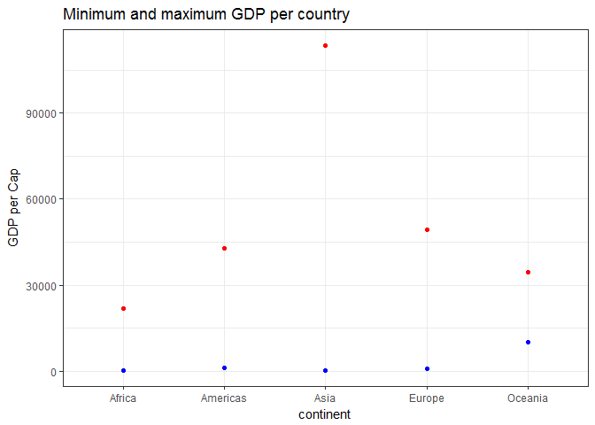
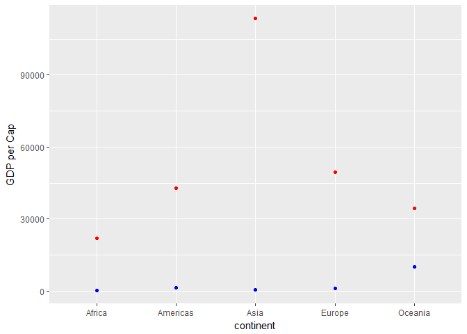
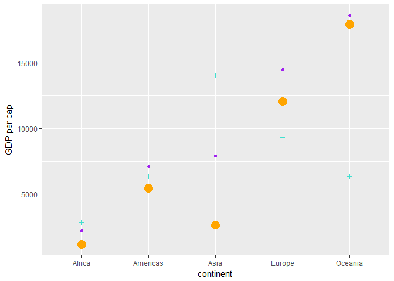

# hw-03
Melanie Ang  
September 27, 2017  

# Homework 3
In this homework, I experiment with dplyr (to manipulate data) and ggplot (to visualize data). Click [here](http://stat545.com/hw03_dplyr-and-more-ggplot2.html) to see the assignment on the STAT545 homework on web

### Step 1: Download packages

```r
library(gapminder) # our data set
library(tidyverse) # dplyr and ggplot2
```

### Task menu
I've picked four task from the selection on the [task section of the website](http://stat545.com/hw03_dplyr-and-more-ggplot2.html#task-menu) 

**1. Get the maximum and minimum of GDP per capita for all continents.**


```r
summary(gapminder)
```

```
##         country        continent        year         lifeExp     
##  Afghanistan:  12   Africa  :624   Min.   :1952   Min.   :23.60  
##  Albania    :  12   Americas:300   1st Qu.:1966   1st Qu.:48.20  
##  Algeria    :  12   Asia    :396   Median :1980   Median :60.71  
##  Angola     :  12   Europe  :360   Mean   :1980   Mean   :59.47  
##  Argentina  :  12   Oceania : 24   3rd Qu.:1993   3rd Qu.:70.85  
##  Australia  :  12                  Max.   :2007   Max.   :82.60  
##  (Other)    :1632                                                
##       pop              gdpPercap       
##  Min.   :6.001e+04   Min.   :   241.2  
##  1st Qu.:2.794e+06   1st Qu.:  1202.1  
##  Median :7.024e+06   Median :  3531.8  
##  Mean   :2.960e+07   Mean   :  7215.3  
##  3rd Qu.:1.959e+07   3rd Qu.:  9325.5  
##  Max.   :1.319e+09   Max.   :113523.1  
## 
```

```r
#gdpPercap
gapminder %>%
  select(continent, gdpPercap) %>%  # subset only relevant columns so its neater
  group_by(continent) %>%           # group according to continents
  summarize(min_gdppercap=min(gdpPercap), 
            max_gdppercap=max(gdpPercap)) %>% 
  knitr::kable()                    # display in kable
```


continent    min_gdppercap   max_gdppercap
----------  --------------  --------------
Africa            241.1659        21951.21
Americas         1201.6372        42951.65
Asia              331.0000       113523.13
Europe            973.5332        49357.19
Oceania         10039.5956        34435.37

```r
p <- gapminder %>%
  select(continent, gdpPercap) %>%  # subset only relevant columns so its neater
  group_by(continent) %>%           # group according to continents
  summarize(min_gdppercap = min(gdpPercap), 
            max_gdppercap = max(gdpPercap)) 

# display just minimum 
ggplot(p, aes(x=continent, y=min_gdppercap)) +
  geom_point()
```

<!-- -->

```r
ggplot(p, aes(x=continent)) +
  geom_point(aes(y=min_gdppercap), colour = "blue") +
  geom_point(aes(y=max_gdppercap), colour = "red") +
  labs(y = "GDP per Cap")
```

<!-- -->

2. Look at the spread of GDP per capita within the continents  
Within spread, I chose to look at mean, standard deviation and median


```r
gapminder %>%
  group_by(continent) %>% 
  summarize(mean_gdp = mean(gdpPercap), sd_gdp = sd(gdpPercap), median_gdp = median(gdpPercap))
```

```
## # A tibble: 5 x 4
##   continent  mean_gdp    sd_gdp median_gdp
##      <fctr>     <dbl>     <dbl>      <dbl>
## 1    Africa  2193.755  2827.930   1192.138
## 2  Americas  7136.110  6396.764   5465.510
## 3      Asia  7902.150 14045.373   2646.787
## 4    Europe 14469.476  9355.213  12081.749
## 5   Oceania 18621.609  6358.983  17983.304
```


```r
gapminder %>%
  group_by(continent) %>% 
  summarize(mean_gdp = mean(gdpPercap), sd_gdp = sd(gdpPercap), median_gdp = median(gdpPercap)) %>% 
  ggplot(aes(x = continent)) +                  # setting continent as base x axis
  geom_point(aes(y = mean_gdp), colour = "purple") + # change colour
  geom_point(aes(y = sd_gdp), colour = "turquoise", shape = 3) + # change shape
  geom_point(aes(y = median_gdp), colour = "orange", size = 5) + # change size
  labs(y = "GDP per cap")
```

<!-- -->

3. How is life expectancy changing over time on different continents?


```r
gapminder %>% 
  group_by(continent) %>% 
  select(continent, lifeExp, year) %>% 
  knitr::kable()
```


continent     lifeExp   year
----------  ---------  -----
Asia         28.80100   1952
Asia         30.33200   1957
Asia         31.99700   1962
Asia         34.02000   1967
Asia         36.08800   1972
Asia         38.43800   1977
Asia         39.85400   1982
Asia         40.82200   1987
Asia         41.67400   1992
Asia         41.76300   1997
Asia         42.12900   2002
Asia         43.82800   2007
Europe       55.23000   1952
Europe       59.28000   1957
Europe       64.82000   1962
Europe       66.22000   1967
Europe       67.69000   1972
Europe       68.93000   1977
Europe       70.42000   1982
Europe       72.00000   1987
Europe       71.58100   1992
Europe       72.95000   1997
Europe       75.65100   2002
Europe       76.42300   2007
Africa       43.07700   1952
Africa       45.68500   1957
Africa       48.30300   1962
Africa       51.40700   1967
Africa       54.51800   1972
Africa       58.01400   1977
Africa       61.36800   1982
Africa       65.79900   1987
Africa       67.74400   1992
Africa       69.15200   1997
Africa       70.99400   2002
Africa       72.30100   2007
Africa       30.01500   1952
Africa       31.99900   1957
Africa       34.00000   1962
Africa       35.98500   1967
Africa       37.92800   1972
Africa       39.48300   1977
Africa       39.94200   1982
Africa       39.90600   1987
Africa       40.64700   1992
Africa       40.96300   1997
Africa       41.00300   2002
Africa       42.73100   2007
Americas     62.48500   1952
Americas     64.39900   1957
Americas     65.14200   1962
Americas     65.63400   1967
Americas     67.06500   1972
Americas     68.48100   1977
Americas     69.94200   1982
Americas     70.77400   1987
Americas     71.86800   1992
Americas     73.27500   1997
Americas     74.34000   2002
Americas     75.32000   2007
Oceania      69.12000   1952
Oceania      70.33000   1957
Oceania      70.93000   1962
Oceania      71.10000   1967
Oceania      71.93000   1972
Oceania      73.49000   1977
Oceania      74.74000   1982
Oceania      76.32000   1987
Oceania      77.56000   1992
Oceania      78.83000   1997
Oceania      80.37000   2002
Oceania      81.23500   2007
Europe       66.80000   1952
Europe       67.48000   1957
Europe       69.54000   1962
Europe       70.14000   1967
Europe       70.63000   1972
Europe       72.17000   1977
Europe       73.18000   1982
Europe       74.94000   1987
Europe       76.04000   1992
Europe       77.51000   1997
Europe       78.98000   2002
Europe       79.82900   2007
Asia         50.93900   1952
Asia         53.83200   1957
Asia         56.92300   1962
Asia         59.92300   1967
Asia         63.30000   1972
Asia         65.59300   1977
Asia         69.05200   1982
Asia         70.75000   1987
Asia         72.60100   1992
Asia         73.92500   1997
Asia         74.79500   2002
Asia         75.63500   2007
Asia         37.48400   1952
Asia         39.34800   1957
Asia         41.21600   1962
Asia         43.45300   1967
Asia         45.25200   1972
Asia         46.92300   1977
Asia         50.00900   1982
Asia         52.81900   1987
Asia         56.01800   1992
Asia         59.41200   1997
Asia         62.01300   2002
Asia         64.06200   2007
Europe       68.00000   1952
Europe       69.24000   1957
Europe       70.25000   1962
Europe       70.94000   1967
Europe       71.44000   1972
Europe       72.80000   1977
Europe       73.93000   1982
Europe       75.35000   1987
Europe       76.46000   1992
Europe       77.53000   1997
Europe       78.32000   2002
Europe       79.44100   2007
Africa       38.22300   1952
Africa       40.35800   1957
Africa       42.61800   1962
Africa       44.88500   1967
Africa       47.01400   1972
Africa       49.19000   1977
Africa       50.90400   1982
Africa       52.33700   1987
Africa       53.91900   1992
Africa       54.77700   1997
Africa       54.40600   2002
Africa       56.72800   2007
Americas     40.41400   1952
Americas     41.89000   1957
Americas     43.42800   1962
Americas     45.03200   1967
Americas     46.71400   1972
Americas     50.02300   1977
Americas     53.85900   1982
Americas     57.25100   1987
Americas     59.95700   1992
Americas     62.05000   1997
Americas     63.88300   2002
Americas     65.55400   2007
Europe       53.82000   1952
Europe       58.45000   1957
Europe       61.93000   1962
Europe       64.79000   1967
Europe       67.45000   1972
Europe       69.86000   1977
Europe       70.69000   1982
Europe       71.14000   1987
Europe       72.17800   1992
Europe       73.24400   1997
Europe       74.09000   2002
Europe       74.85200   2007
Africa       47.62200   1952
Africa       49.61800   1957
Africa       51.52000   1962
Africa       53.29800   1967
Africa       56.02400   1972
Africa       59.31900   1977
Africa       61.48400   1982
Africa       63.62200   1987
Africa       62.74500   1992
Africa       52.55600   1997
Africa       46.63400   2002
Africa       50.72800   2007
Americas     50.91700   1952
Americas     53.28500   1957
Americas     55.66500   1962
Americas     57.63200   1967
Americas     59.50400   1972
Americas     61.48900   1977
Americas     63.33600   1982
Americas     65.20500   1987
Americas     67.05700   1992
Americas     69.38800   1997
Americas     71.00600   2002
Americas     72.39000   2007
Europe       59.60000   1952
Europe       66.61000   1957
Europe       69.51000   1962
Europe       70.42000   1967
Europe       70.90000   1972
Europe       70.81000   1977
Europe       71.08000   1982
Europe       71.34000   1987
Europe       71.19000   1992
Europe       70.32000   1997
Europe       72.14000   2002
Europe       73.00500   2007
Africa       31.97500   1952
Africa       34.90600   1957
Africa       37.81400   1962
Africa       40.69700   1967
Africa       43.59100   1972
Africa       46.13700   1977
Africa       48.12200   1982
Africa       49.55700   1987
Africa       50.26000   1992
Africa       50.32400   1997
Africa       50.65000   2002
Africa       52.29500   2007
Africa       39.03100   1952
Africa       40.53300   1957
Africa       42.04500   1962
Africa       43.54800   1967
Africa       44.05700   1972
Africa       45.91000   1977
Africa       47.47100   1982
Africa       48.21100   1987
Africa       44.73600   1992
Africa       45.32600   1997
Africa       47.36000   2002
Africa       49.58000   2007
Asia         39.41700   1952
Asia         41.36600   1957
Asia         43.41500   1962
Asia         45.41500   1967
Asia         40.31700   1972
Asia         31.22000   1977
Asia         50.95700   1982
Asia         53.91400   1987
Asia         55.80300   1992
Asia         56.53400   1997
Asia         56.75200   2002
Asia         59.72300   2007
Africa       38.52300   1952
Africa       40.42800   1957
Africa       42.64300   1962
Africa       44.79900   1967
Africa       47.04900   1972
Africa       49.35500   1977
Africa       52.96100   1982
Africa       54.98500   1987
Africa       54.31400   1992
Africa       52.19900   1997
Africa       49.85600   2002
Africa       50.43000   2007
Americas     68.75000   1952
Americas     69.96000   1957
Americas     71.30000   1962
Americas     72.13000   1967
Americas     72.88000   1972
Americas     74.21000   1977
Americas     75.76000   1982
Americas     76.86000   1987
Americas     77.95000   1992
Americas     78.61000   1997
Americas     79.77000   2002
Americas     80.65300   2007
Africa       35.46300   1952
Africa       37.46400   1957
Africa       39.47500   1962
Africa       41.47800   1967
Africa       43.45700   1972
Africa       46.77500   1977
Africa       48.29500   1982
Africa       50.48500   1987
Africa       49.39600   1992
Africa       46.06600   1997
Africa       43.30800   2002
Africa       44.74100   2007
Africa       38.09200   1952
Africa       39.88100   1957
Africa       41.71600   1962
Africa       43.60100   1967
Africa       45.56900   1972
Africa       47.38300   1977
Africa       49.51700   1982
Africa       51.05100   1987
Africa       51.72400   1992
Africa       51.57300   1997
Africa       50.52500   2002
Africa       50.65100   2007
Americas     54.74500   1952
Americas     56.07400   1957
Americas     57.92400   1962
Americas     60.52300   1967
Americas     63.44100   1972
Americas     67.05200   1977
Americas     70.56500   1982
Americas     72.49200   1987
Americas     74.12600   1992
Americas     75.81600   1997
Americas     77.86000   2002
Americas     78.55300   2007
Asia         44.00000   1952
Asia         50.54896   1957
Asia         44.50136   1962
Asia         58.38112   1967
Asia         63.11888   1972
Asia         63.96736   1977
Asia         65.52500   1982
Asia         67.27400   1987
Asia         68.69000   1992
Asia         70.42600   1997
Asia         72.02800   2002
Asia         72.96100   2007
Americas     50.64300   1952
Americas     55.11800   1957
Americas     57.86300   1962
Americas     59.96300   1967
Americas     61.62300   1972
Americas     63.83700   1977
Americas     66.65300   1982
Americas     67.76800   1987
Americas     68.42100   1992
Americas     70.31300   1997
Americas     71.68200   2002
Americas     72.88900   2007
Africa       40.71500   1952
Africa       42.46000   1957
Africa       44.46700   1962
Africa       46.47200   1967
Africa       48.94400   1972
Africa       50.93900   1977
Africa       52.93300   1982
Africa       54.92600   1987
Africa       57.93900   1992
Africa       60.66000   1997
Africa       62.97400   2002
Africa       65.15200   2007
Africa       39.14300   1952
Africa       40.65200   1957
Africa       42.12200   1962
Africa       44.05600   1967
Africa       45.98900   1972
Africa       47.80400   1977
Africa       47.78400   1982
Africa       47.41200   1987
Africa       45.54800   1992
Africa       42.58700   1997
Africa       44.96600   2002
Africa       46.46200   2007
Africa       42.11100   1952
Africa       45.05300   1957
Africa       48.43500   1962
Africa       52.04000   1967
Africa       54.90700   1972
Africa       55.62500   1977
Africa       56.69500   1982
Africa       57.47000   1987
Africa       56.43300   1992
Africa       52.96200   1997
Africa       52.97000   2002
Africa       55.32200   2007
Americas     57.20600   1952
Americas     60.02600   1957
Americas     62.84200   1962
Americas     65.42400   1967
Americas     67.84900   1972
Americas     70.75000   1977
Americas     73.45000   1982
Americas     74.75200   1987
Americas     75.71300   1992
Americas     77.26000   1997
Americas     78.12300   2002
Americas     78.78200   2007
Africa       40.47700   1952
Africa       42.46900   1957
Africa       44.93000   1962
Africa       47.35000   1967
Africa       49.80100   1972
Africa       52.37400   1977
Africa       53.98300   1982
Africa       54.65500   1987
Africa       52.04400   1992
Africa       47.99100   1997
Africa       46.83200   2002
Africa       48.32800   2007
Europe       61.21000   1952
Europe       64.77000   1957
Europe       67.13000   1962
Europe       68.50000   1967
Europe       69.61000   1972
Europe       70.64000   1977
Europe       70.46000   1982
Europe       71.52000   1987
Europe       72.52700   1992
Europe       73.68000   1997
Europe       74.87600   2002
Europe       75.74800   2007
Americas     59.42100   1952
Americas     62.32500   1957
Americas     65.24600   1962
Americas     68.29000   1967
Americas     70.72300   1972
Americas     72.64900   1977
Americas     73.71700   1982
Americas     74.17400   1987
Americas     74.41400   1992
Americas     76.15100   1997
Americas     77.15800   2002
Americas     78.27300   2007
Europe       66.87000   1952
Europe       69.03000   1957
Europe       69.90000   1962
Europe       70.38000   1967
Europe       70.29000   1972
Europe       70.71000   1977
Europe       70.96000   1982
Europe       71.58000   1987
Europe       72.40000   1992
Europe       74.01000   1997
Europe       75.51000   2002
Europe       76.48600   2007
Europe       70.78000   1952
Europe       71.81000   1957
Europe       72.35000   1962
Europe       72.96000   1967
Europe       73.47000   1972
Europe       74.69000   1977
Europe       74.63000   1982
Europe       74.80000   1987
Europe       75.33000   1992
Europe       76.11000   1997
Europe       77.18000   2002
Europe       78.33200   2007
Africa       34.81200   1952
Africa       37.32800   1957
Africa       39.69300   1962
Africa       42.07400   1967
Africa       44.36600   1972
Africa       46.51900   1977
Africa       48.81200   1982
Africa       50.04000   1987
Africa       51.60400   1992
Africa       53.15700   1997
Africa       53.37300   2002
Africa       54.79100   2007
Americas     45.92800   1952
Americas     49.82800   1957
Americas     53.45900   1962
Americas     56.75100   1967
Americas     59.63100   1972
Americas     61.78800   1977
Americas     63.72700   1982
Americas     66.04600   1987
Americas     68.45700   1992
Americas     69.95700   1997
Americas     70.84700   2002
Americas     72.23500   2007
Americas     48.35700   1952
Americas     51.35600   1957
Americas     54.64000   1962
Americas     56.67800   1967
Americas     58.79600   1972
Americas     61.31000   1977
Americas     64.34200   1982
Americas     67.23100   1987
Americas     69.61300   1992
Americas     72.31200   1997
Americas     74.17300   2002
Americas     74.99400   2007
Africa       41.89300   1952
Africa       44.44400   1957
Africa       46.99200   1962
Africa       49.29300   1967
Africa       51.13700   1972
Africa       53.31900   1977
Africa       56.00600   1982
Africa       59.79700   1987
Africa       63.67400   1992
Africa       67.21700   1997
Africa       69.80600   2002
Africa       71.33800   2007
Americas     45.26200   1952
Americas     48.57000   1957
Americas     52.30700   1962
Americas     55.85500   1967
Americas     58.20700   1972
Americas     56.69600   1977
Americas     56.60400   1982
Americas     63.15400   1987
Americas     66.79800   1992
Americas     69.53500   1997
Americas     70.73400   2002
Americas     71.87800   2007
Africa       34.48200   1952
Africa       35.98300   1957
Africa       37.48500   1962
Africa       38.98700   1967
Africa       40.51600   1972
Africa       42.02400   1977
Africa       43.66200   1982
Africa       45.66400   1987
Africa       47.54500   1992
Africa       48.24500   1997
Africa       49.34800   2002
Africa       51.57900   2007
Africa       35.92800   1952
Africa       38.04700   1957
Africa       40.15800   1962
Africa       42.18900   1967
Africa       44.14200   1972
Africa       44.53500   1977
Africa       43.89000   1982
Africa       46.45300   1987
Africa       49.99100   1992
Africa       53.37800   1997
Africa       55.24000   2002
Africa       58.04000   2007
Africa       34.07800   1952
Africa       36.66700   1957
Africa       40.05900   1962
Africa       42.11500   1967
Africa       43.51500   1972
Africa       44.51000   1977
Africa       44.91600   1982
Africa       46.68400   1987
Africa       48.09100   1992
Africa       49.40200   1997
Africa       50.72500   2002
Africa       52.94700   2007
Europe       66.55000   1952
Europe       67.49000   1957
Europe       68.75000   1962
Europe       69.83000   1967
Europe       70.87000   1972
Europe       72.52000   1977
Europe       74.55000   1982
Europe       74.83000   1987
Europe       75.70000   1992
Europe       77.13000   1997
Europe       78.37000   2002
Europe       79.31300   2007
Europe       67.41000   1952
Europe       68.93000   1957
Europe       70.51000   1962
Europe       71.55000   1967
Europe       72.38000   1972
Europe       73.83000   1977
Europe       74.89000   1982
Europe       76.34000   1987
Europe       77.46000   1992
Europe       78.64000   1997
Europe       79.59000   2002
Europe       80.65700   2007
Africa       37.00300   1952
Africa       38.99900   1957
Africa       40.48900   1962
Africa       44.59800   1967
Africa       48.69000   1972
Africa       52.79000   1977
Africa       56.56400   1982
Africa       60.19000   1987
Africa       61.36600   1992
Africa       60.46100   1997
Africa       56.76100   2002
Africa       56.73500   2007
Africa       30.00000   1952
Africa       32.06500   1957
Africa       33.89600   1962
Africa       35.85700   1967
Africa       38.30800   1972
Africa       41.84200   1977
Africa       45.58000   1982
Africa       49.26500   1987
Africa       52.64400   1992
Africa       55.86100   1997
Africa       58.04100   2002
Africa       59.44800   2007
Europe       67.50000   1952
Europe       69.10000   1957
Europe       70.30000   1962
Europe       70.80000   1967
Europe       71.00000   1972
Europe       72.50000   1977
Europe       73.80000   1982
Europe       74.84700   1987
Europe       76.07000   1992
Europe       77.34000   1997
Europe       78.67000   2002
Europe       79.40600   2007
Africa       43.14900   1952
Africa       44.77900   1957
Africa       46.45200   1962
Africa       48.07200   1967
Africa       49.87500   1972
Africa       51.75600   1977
Africa       53.74400   1982
Africa       55.72900   1987
Africa       57.50100   1992
Africa       58.55600   1997
Africa       58.45300   2002
Africa       60.02200   2007
Europe       65.86000   1952
Europe       67.86000   1957
Europe       69.51000   1962
Europe       71.00000   1967
Europe       72.34000   1972
Europe       73.68000   1977
Europe       75.24000   1982
Europe       76.67000   1987
Europe       77.03000   1992
Europe       77.86900   1997
Europe       78.25600   2002
Europe       79.48300   2007
Americas     42.02300   1952
Americas     44.14200   1957
Americas     46.95400   1962
Americas     50.01600   1967
Americas     53.73800   1972
Americas     56.02900   1977
Americas     58.13700   1982
Americas     60.78200   1987
Americas     63.37300   1992
Americas     66.32200   1997
Americas     68.97800   2002
Americas     70.25900   2007
Africa       33.60900   1952
Africa       34.55800   1957
Africa       35.75300   1962
Africa       37.19700   1967
Africa       38.84200   1972
Africa       40.76200   1977
Africa       42.89100   1982
Africa       45.55200   1987
Africa       48.57600   1992
Africa       51.45500   1997
Africa       53.67600   2002
Africa       56.00700   2007
Africa       32.50000   1952
Africa       33.48900   1957
Africa       34.48800   1962
Africa       35.49200   1967
Africa       36.48600   1972
Africa       37.46500   1977
Africa       39.32700   1982
Africa       41.24500   1987
Africa       43.26600   1992
Africa       44.87300   1997
Africa       45.50400   2002
Africa       46.38800   2007
Americas     37.57900   1952
Americas     40.69600   1957
Americas     43.59000   1962
Americas     46.24300   1967
Americas     48.04200   1972
Americas     49.92300   1977
Americas     51.46100   1982
Americas     53.63600   1987
Americas     55.08900   1992
Americas     56.67100   1997
Americas     58.13700   2002
Americas     60.91600   2007
Americas     41.91200   1952
Americas     44.66500   1957
Americas     48.04100   1962
Americas     50.92400   1967
Americas     53.88400   1972
Americas     57.40200   1977
Americas     60.90900   1982
Americas     64.49200   1987
Americas     66.39900   1992
Americas     67.65900   1997
Americas     68.56500   2002
Americas     70.19800   2007
Asia         60.96000   1952
Asia         64.75000   1957
Asia         67.65000   1962
Asia         70.00000   1967
Asia         72.00000   1972
Asia         73.60000   1977
Asia         75.45000   1982
Asia         76.20000   1987
Asia         77.60100   1992
Asia         80.00000   1997
Asia         81.49500   2002
Asia         82.20800   2007
Europe       64.03000   1952
Europe       66.41000   1957
Europe       67.96000   1962
Europe       69.50000   1967
Europe       69.76000   1972
Europe       69.95000   1977
Europe       69.39000   1982
Europe       69.58000   1987
Europe       69.17000   1992
Europe       71.04000   1997
Europe       72.59000   2002
Europe       73.33800   2007
Europe       72.49000   1952
Europe       73.47000   1957
Europe       73.68000   1962
Europe       73.73000   1967
Europe       74.46000   1972
Europe       76.11000   1977
Europe       76.99000   1982
Europe       77.23000   1987
Europe       78.77000   1992
Europe       78.95000   1997
Europe       80.50000   2002
Europe       81.75700   2007
Asia         37.37300   1952
Asia         40.24900   1957
Asia         43.60500   1962
Asia         47.19300   1967
Asia         50.65100   1972
Asia         54.20800   1977
Asia         56.59600   1982
Asia         58.55300   1987
Asia         60.22300   1992
Asia         61.76500   1997
Asia         62.87900   2002
Asia         64.69800   2007
Asia         37.46800   1952
Asia         39.91800   1957
Asia         42.51800   1962
Asia         45.96400   1967
Asia         49.20300   1972
Asia         52.70200   1977
Asia         56.15900   1982
Asia         60.13700   1987
Asia         62.68100   1992
Asia         66.04100   1997
Asia         68.58800   2002
Asia         70.65000   2007
Asia         44.86900   1952
Asia         47.18100   1957
Asia         49.32500   1962
Asia         52.46900   1967
Asia         55.23400   1972
Asia         57.70200   1977
Asia         59.62000   1982
Asia         63.04000   1987
Asia         65.74200   1992
Asia         68.04200   1997
Asia         69.45100   2002
Asia         70.96400   2007
Asia         45.32000   1952
Asia         48.43700   1957
Asia         51.45700   1962
Asia         54.45900   1967
Asia         56.95000   1972
Asia         60.41300   1977
Asia         62.03800   1982
Asia         65.04400   1987
Asia         59.46100   1992
Asia         58.81100   1997
Asia         57.04600   2002
Asia         59.54500   2007
Europe       66.91000   1952
Europe       68.90000   1957
Europe       70.29000   1962
Europe       71.08000   1967
Europe       71.28000   1972
Europe       72.03000   1977
Europe       73.10000   1982
Europe       74.36000   1987
Europe       75.46700   1992
Europe       76.12200   1997
Europe       77.78300   2002
Europe       78.88500   2007
Asia         65.39000   1952
Asia         67.84000   1957
Asia         69.39000   1962
Asia         70.75000   1967
Asia         71.63000   1972
Asia         73.06000   1977
Asia         74.45000   1982
Asia         75.60000   1987
Asia         76.93000   1992
Asia         78.26900   1997
Asia         79.69600   2002
Asia         80.74500   2007
Europe       65.94000   1952
Europe       67.81000   1957
Europe       69.24000   1962
Europe       71.06000   1967
Europe       72.19000   1972
Europe       73.48000   1977
Europe       74.98000   1982
Europe       76.42000   1987
Europe       77.44000   1992
Europe       78.82000   1997
Europe       80.24000   2002
Europe       80.54600   2007
Americas     58.53000   1952
Americas     62.61000   1957
Americas     65.61000   1962
Americas     67.51000   1967
Americas     69.00000   1972
Americas     70.11000   1977
Americas     71.21000   1982
Americas     71.77000   1987
Americas     71.76600   1992
Americas     72.26200   1997
Americas     72.04700   2002
Americas     72.56700   2007
Asia         63.03000   1952
Asia         65.50000   1957
Asia         68.73000   1962
Asia         71.43000   1967
Asia         73.42000   1972
Asia         75.38000   1977
Asia         77.11000   1982
Asia         78.67000   1987
Asia         79.36000   1992
Asia         80.69000   1997
Asia         82.00000   2002
Asia         82.60300   2007
Asia         43.15800   1952
Asia         45.66900   1957
Asia         48.12600   1962
Asia         51.62900   1967
Asia         56.52800   1972
Asia         61.13400   1977
Asia         63.73900   1982
Asia         65.86900   1987
Asia         68.01500   1992
Asia         69.77200   1997
Asia         71.26300   2002
Asia         72.53500   2007
Africa       42.27000   1952
Africa       44.68600   1957
Africa       47.94900   1962
Africa       50.65400   1967
Africa       53.55900   1972
Africa       56.15500   1977
Africa       58.76600   1982
Africa       59.33900   1987
Africa       59.28500   1992
Africa       54.40700   1997
Africa       50.99200   2002
Africa       54.11000   2007
Asia         50.05600   1952
Asia         54.08100   1957
Asia         56.65600   1962
Asia         59.94200   1967
Asia         63.98300   1972
Asia         67.15900   1977
Asia         69.10000   1982
Asia         70.64700   1987
Asia         69.97800   1992
Asia         67.72700   1997
Asia         66.66200   2002
Asia         67.29700   2007
Asia         47.45300   1952
Asia         52.68100   1957
Asia         55.29200   1962
Asia         57.71600   1967
Asia         62.61200   1972
Asia         64.76600   1977
Asia         67.12300   1982
Asia         69.81000   1987
Asia         72.24400   1992
Asia         74.64700   1997
Asia         77.04500   2002
Asia         78.62300   2007
Asia         55.56500   1952
Asia         58.03300   1957
Asia         60.47000   1962
Asia         64.62400   1967
Asia         67.71200   1972
Asia         69.34300   1977
Asia         71.30900   1982
Asia         74.17400   1987
Asia         75.19000   1992
Asia         76.15600   1997
Asia         76.90400   2002
Asia         77.58800   2007
Asia         55.92800   1952
Asia         59.48900   1957
Asia         62.09400   1962
Asia         63.87000   1967
Asia         65.42100   1972
Asia         66.09900   1977
Asia         66.98300   1982
Asia         67.92600   1987
Asia         69.29200   1992
Asia         70.26500   1997
Asia         71.02800   2002
Asia         71.99300   2007
Africa       42.13800   1952
Africa       45.04700   1957
Africa       47.74700   1962
Africa       48.49200   1967
Africa       49.76700   1972
Africa       52.20800   1977
Africa       55.07800   1982
Africa       57.18000   1987
Africa       59.68500   1992
Africa       55.55800   1997
Africa       44.59300   2002
Africa       42.59200   2007
Africa       38.48000   1952
Africa       39.48600   1957
Africa       40.50200   1962
Africa       41.53600   1967
Africa       42.61400   1972
Africa       43.76400   1977
Africa       44.85200   1982
Africa       46.02700   1987
Africa       40.80200   1992
Africa       42.22100   1997
Africa       43.75300   2002
Africa       45.67800   2007
Africa       42.72300   1952
Africa       45.28900   1957
Africa       47.80800   1962
Africa       50.22700   1967
Africa       52.77300   1972
Africa       57.44200   1977
Africa       62.15500   1982
Africa       66.23400   1987
Africa       68.75500   1992
Africa       71.55500   1997
Africa       72.73700   2002
Africa       73.95200   2007
Africa       36.68100   1952
Africa       38.86500   1957
Africa       40.84800   1962
Africa       42.88100   1967
Africa       44.85100   1972
Africa       46.88100   1977
Africa       48.96900   1982
Africa       49.35000   1987
Africa       52.21400   1992
Africa       54.97800   1997
Africa       57.28600   2002
Africa       59.44300   2007
Africa       36.25600   1952
Africa       37.20700   1957
Africa       38.41000   1962
Africa       39.48700   1967
Africa       41.76600   1972
Africa       43.76700   1977
Africa       45.64200   1982
Africa       47.45700   1987
Africa       49.42000   1992
Africa       47.49500   1997
Africa       45.00900   2002
Africa       48.30300   2007
Asia         48.46300   1952
Asia         52.10200   1957
Asia         55.73700   1962
Asia         59.37100   1967
Asia         63.01000   1972
Asia         65.25600   1977
Asia         68.00000   1982
Asia         69.50000   1987
Asia         70.69300   1992
Asia         71.93800   1997
Asia         73.04400   2002
Asia         74.24100   2007
Africa       33.68500   1952
Africa       35.30700   1957
Africa       36.93600   1962
Africa       38.48700   1967
Africa       39.97700   1972
Africa       41.71400   1977
Africa       43.91600   1982
Africa       46.36400   1987
Africa       48.38800   1992
Africa       49.90300   1997
Africa       51.81800   2002
Africa       54.46700   2007
Africa       40.54300   1952
Africa       42.33800   1957
Africa       44.24800   1962
Africa       46.28900   1967
Africa       48.43700   1972
Africa       50.85200   1977
Africa       53.59900   1982
Africa       56.14500   1987
Africa       58.33300   1992
Africa       60.43000   1997
Africa       62.24700   2002
Africa       64.16400   2007
Africa       50.98600   1952
Africa       58.08900   1957
Africa       60.24600   1962
Africa       61.55700   1967
Africa       62.94400   1972
Africa       64.93000   1977
Africa       66.71100   1982
Africa       68.74000   1987
Africa       69.74500   1992
Africa       70.73600   1997
Africa       71.95400   2002
Africa       72.80100   2007
Americas     50.78900   1952
Americas     55.19000   1957
Americas     58.29900   1962
Americas     60.11000   1967
Americas     62.36100   1972
Americas     65.03200   1977
Americas     67.40500   1982
Americas     69.49800   1987
Americas     71.45500   1992
Americas     73.67000   1997
Americas     74.90200   2002
Americas     76.19500   2007
Asia         42.24400   1952
Asia         45.24800   1957
Asia         48.25100   1962
Asia         51.25300   1967
Asia         53.75400   1972
Asia         55.49100   1977
Asia         57.48900   1982
Asia         60.22200   1987
Asia         61.27100   1992
Asia         63.62500   1997
Asia         65.03300   2002
Asia         66.80300   2007
Europe       59.16400   1952
Europe       61.44800   1957
Europe       63.72800   1962
Europe       67.17800   1967
Europe       70.63600   1972
Europe       73.06600   1977
Europe       74.10100   1982
Europe       74.86500   1987
Europe       75.43500   1992
Europe       75.44500   1997
Europe       73.98100   2002
Europe       74.54300   2007
Africa       42.87300   1952
Africa       45.42300   1957
Africa       47.92400   1962
Africa       50.33500   1967
Africa       52.86200   1972
Africa       55.73000   1977
Africa       59.65000   1982
Africa       62.67700   1987
Africa       65.39300   1992
Africa       67.66000   1997
Africa       69.61500   2002
Africa       71.16400   2007
Africa       31.28600   1952
Africa       33.77900   1957
Africa       36.16100   1962
Africa       38.11300   1967
Africa       40.32800   1972
Africa       42.49500   1977
Africa       42.79500   1982
Africa       42.86100   1987
Africa       44.28400   1992
Africa       46.34400   1997
Africa       44.02600   2002
Africa       42.08200   2007
Asia         36.31900   1952
Asia         41.90500   1957
Asia         45.10800   1962
Asia         49.37900   1967
Asia         53.07000   1972
Asia         56.05900   1977
Asia         58.05600   1982
Asia         58.33900   1987
Asia         59.32000   1992
Asia         60.32800   1997
Asia         59.90800   2002
Asia         62.06900   2007
Africa       41.72500   1952
Africa       45.22600   1957
Africa       48.38600   1962
Africa       51.15900   1967
Africa       53.86700   1972
Africa       56.43700   1977
Africa       58.96800   1982
Africa       60.83500   1987
Africa       61.99900   1992
Africa       58.90900   1997
Africa       51.47900   2002
Africa       52.90600   2007
Asia         36.15700   1952
Asia         37.68600   1957
Asia         39.39300   1962
Asia         41.47200   1967
Asia         43.97100   1972
Asia         46.74800   1977
Asia         49.59400   1982
Asia         52.53700   1987
Asia         55.72700   1992
Asia         59.42600   1997
Asia         61.34000   2002
Asia         63.78500   2007
Europe       72.13000   1952
Europe       72.99000   1957
Europe       73.23000   1962
Europe       73.82000   1967
Europe       73.75000   1972
Europe       75.24000   1977
Europe       76.05000   1982
Europe       76.83000   1987
Europe       77.42000   1992
Europe       78.03000   1997
Europe       78.53000   2002
Europe       79.76200   2007
Oceania      69.39000   1952
Oceania      70.26000   1957
Oceania      71.24000   1962
Oceania      71.52000   1967
Oceania      71.89000   1972
Oceania      72.22000   1977
Oceania      73.84000   1982
Oceania      74.32000   1987
Oceania      76.33000   1992
Oceania      77.55000   1997
Oceania      79.11000   2002
Oceania      80.20400   2007
Americas     42.31400   1952
Americas     45.43200   1957
Americas     48.63200   1962
Americas     51.88400   1967
Americas     55.15100   1972
Americas     57.47000   1977
Americas     59.29800   1982
Americas     62.00800   1987
Americas     65.84300   1992
Americas     68.42600   1997
Americas     70.83600   2002
Americas     72.89900   2007
Africa       37.44400   1952
Africa       38.59800   1957
Africa       39.48700   1962
Africa       40.11800   1967
Africa       40.54600   1972
Africa       41.29100   1977
Africa       42.59800   1982
Africa       44.55500   1987
Africa       47.39100   1992
Africa       51.31300   1997
Africa       54.49600   2002
Africa       56.86700   2007
Africa       36.32400   1952
Africa       37.80200   1957
Africa       39.36000   1962
Africa       41.04000   1967
Africa       42.82100   1972
Africa       44.51400   1977
Africa       45.82600   1982
Africa       46.88600   1987
Africa       47.47200   1992
Africa       47.46400   1997
Africa       46.60800   2002
Africa       46.85900   2007
Europe       72.67000   1952
Europe       73.44000   1957
Europe       73.47000   1962
Europe       74.08000   1967
Europe       74.34000   1972
Europe       75.37000   1977
Europe       75.97000   1982
Europe       75.89000   1987
Europe       77.32000   1992
Europe       78.32000   1997
Europe       79.05000   2002
Europe       80.19600   2007
Asia         37.57800   1952
Asia         40.08000   1957
Asia         43.16500   1962
Asia         46.98800   1967
Asia         52.14300   1972
Asia         57.36700   1977
Asia         62.72800   1982
Asia         67.73400   1987
Asia         71.19700   1992
Asia         72.49900   1997
Asia         74.19300   2002
Asia         75.64000   2007
Asia         43.43600   1952
Asia         45.55700   1957
Asia         47.67000   1962
Asia         49.80000   1967
Asia         51.92900   1972
Asia         54.04300   1977
Asia         56.15800   1982
Asia         58.24500   1987
Asia         60.83800   1992
Asia         61.81800   1997
Asia         63.61000   2002
Asia         65.48300   2007
Americas     55.19100   1952
Americas     59.20100   1957
Americas     61.81700   1962
Americas     64.07100   1967
Americas     66.21600   1972
Americas     68.68100   1977
Americas     70.47200   1982
Americas     71.52300   1987
Americas     72.46200   1992
Americas     73.73800   1997
Americas     74.71200   2002
Americas     75.53700   2007
Americas     62.64900   1952
Americas     63.19600   1957
Americas     64.36100   1962
Americas     64.95100   1967
Americas     65.81500   1972
Americas     66.35300   1977
Americas     66.87400   1982
Americas     67.37800   1987
Americas     68.22500   1992
Americas     69.40000   1997
Americas     70.75500   2002
Americas     71.75200   2007
Americas     43.90200   1952
Americas     46.26300   1957
Americas     49.09600   1962
Americas     51.44500   1967
Americas     55.44800   1972
Americas     58.44700   1977
Americas     61.40600   1982
Americas     64.13400   1987
Americas     66.45800   1992
Americas     68.38600   1997
Americas     69.90600   2002
Americas     71.42100   2007
Asia         47.75200   1952
Asia         51.33400   1957
Asia         54.75700   1962
Asia         56.39300   1967
Asia         58.06500   1972
Asia         60.06000   1977
Asia         62.08200   1982
Asia         64.15100   1987
Asia         66.45800   1992
Asia         68.56400   1997
Asia         70.30300   2002
Asia         71.68800   2007
Europe       61.31000   1952
Europe       65.77000   1957
Europe       67.64000   1962
Europe       69.61000   1967
Europe       70.85000   1972
Europe       70.67000   1977
Europe       71.32000   1982
Europe       70.98000   1987
Europe       70.99000   1992
Europe       72.75000   1997
Europe       74.67000   2002
Europe       75.56300   2007
Europe       59.82000   1952
Europe       61.51000   1957
Europe       64.39000   1962
Europe       66.60000   1967
Europe       69.26000   1972
Europe       70.41000   1977
Europe       72.77000   1982
Europe       74.06000   1987
Europe       74.86000   1992
Europe       75.97000   1997
Europe       77.29000   2002
Europe       78.09800   2007
Americas     64.28000   1952
Americas     68.54000   1957
Americas     69.62000   1962
Americas     71.10000   1967
Americas     72.16000   1972
Americas     73.44000   1977
Americas     73.75000   1982
Americas     74.63000   1987
Americas     73.91100   1992
Americas     74.91700   1997
Americas     77.77800   2002
Americas     78.74600   2007
Africa       52.72400   1952
Africa       55.09000   1957
Africa       57.66600   1962
Africa       60.54200   1967
Africa       64.27400   1972
Africa       67.06400   1977
Africa       69.88500   1982
Africa       71.91300   1987
Africa       73.61500   1992
Africa       74.77200   1997
Africa       75.74400   2002
Africa       76.44200   2007
Europe       61.05000   1952
Europe       64.10000   1957
Europe       66.80000   1962
Europe       66.80000   1967
Europe       69.21000   1972
Europe       69.46000   1977
Europe       69.66000   1982
Europe       69.53000   1987
Europe       69.36000   1992
Europe       69.72000   1997
Europe       71.32200   2002
Europe       72.47600   2007
Africa       40.00000   1952
Africa       41.50000   1957
Africa       43.00000   1962
Africa       44.10000   1967
Africa       44.60000   1972
Africa       45.00000   1977
Africa       46.21800   1982
Africa       44.02000   1987
Africa       23.59900   1992
Africa       36.08700   1997
Africa       43.41300   2002
Africa       46.24200   2007
Africa       46.47100   1952
Africa       48.94500   1957
Africa       51.89300   1962
Africa       54.42500   1967
Africa       56.48000   1972
Africa       58.55000   1977
Africa       60.35100   1982
Africa       61.72800   1987
Africa       62.74200   1992
Africa       63.30600   1997
Africa       64.33700   2002
Africa       65.52800   2007
Asia         39.87500   1952
Asia         42.86800   1957
Asia         45.91400   1962
Asia         49.90100   1967
Asia         53.88600   1972
Asia         58.69000   1977
Asia         63.01200   1982
Asia         66.29500   1987
Asia         68.76800   1992
Asia         70.53300   1997
Asia         71.62600   2002
Asia         72.77700   2007
Africa       37.27800   1952
Africa       39.32900   1957
Africa       41.45400   1962
Africa       43.56300   1967
Africa       45.81500   1972
Africa       48.87900   1977
Africa       52.37900   1982
Africa       55.76900   1987
Africa       58.19600   1992
Africa       60.18700   1997
Africa       61.60000   2002
Africa       63.06200   2007
Europe       57.99600   1952
Europe       61.68500   1957
Europe       64.53100   1962
Europe       66.91400   1967
Europe       68.70000   1972
Europe       70.30000   1977
Europe       70.16200   1982
Europe       71.21800   1987
Europe       71.65900   1992
Europe       72.23200   1997
Europe       73.21300   2002
Europe       74.00200   2007
Africa       30.33100   1952
Africa       31.57000   1957
Africa       32.76700   1962
Africa       34.11300   1967
Africa       35.40000   1972
Africa       36.78800   1977
Africa       38.44500   1982
Africa       40.00600   1987
Africa       38.33300   1992
Africa       39.89700   1997
Africa       41.01200   2002
Africa       42.56800   2007
Asia         60.39600   1952
Asia         63.17900   1957
Asia         65.79800   1962
Asia         67.94600   1967
Asia         69.52100   1972
Asia         70.79500   1977
Asia         71.76000   1982
Asia         73.56000   1987
Asia         75.78800   1992
Asia         77.15800   1997
Asia         78.77000   2002
Asia         79.97200   2007
Europe       64.36000   1952
Europe       67.45000   1957
Europe       70.33000   1962
Europe       70.98000   1967
Europe       70.35000   1972
Europe       70.45000   1977
Europe       70.80000   1982
Europe       71.08000   1987
Europe       71.38000   1992
Europe       72.71000   1997
Europe       73.80000   2002
Europe       74.66300   2007
Europe       65.57000   1952
Europe       67.85000   1957
Europe       69.15000   1962
Europe       69.18000   1967
Europe       69.82000   1972
Europe       70.97000   1977
Europe       71.06300   1982
Europe       72.25000   1987
Europe       73.64000   1992
Europe       75.13000   1997
Europe       76.66000   2002
Europe       77.92600   2007
Africa       32.97800   1952
Africa       34.97700   1957
Africa       36.98100   1962
Africa       38.97700   1967
Africa       40.97300   1972
Africa       41.97400   1977
Africa       42.95500   1982
Africa       44.50100   1987
Africa       39.65800   1992
Africa       43.79500   1997
Africa       45.93600   2002
Africa       48.15900   2007
Africa       45.00900   1952
Africa       47.98500   1957
Africa       49.95100   1962
Africa       51.92700   1967
Africa       53.69600   1972
Africa       55.52700   1977
Africa       58.16100   1982
Africa       60.83400   1987
Africa       61.88800   1992
Africa       60.23600   1997
Africa       53.36500   2002
Africa       49.33900   2007
Europe       64.94000   1952
Europe       66.66000   1957
Europe       69.69000   1962
Europe       71.44000   1967
Europe       73.06000   1972
Europe       74.39000   1977
Europe       76.30000   1982
Europe       76.90000   1987
Europe       77.57000   1992
Europe       78.77000   1997
Europe       79.78000   2002
Europe       80.94100   2007
Asia         57.59300   1952
Asia         61.45600   1957
Asia         62.19200   1962
Asia         64.26600   1967
Asia         65.04200   1972
Asia         65.94900   1977
Asia         68.75700   1982
Asia         69.01100   1987
Asia         70.37900   1992
Asia         70.45700   1997
Asia         70.81500   2002
Asia         72.39600   2007
Africa       38.63500   1952
Africa       39.62400   1957
Africa       40.87000   1962
Africa       42.85800   1967
Africa       45.08300   1972
Africa       47.80000   1977
Africa       50.33800   1982
Africa       51.74400   1987
Africa       53.55600   1992
Africa       55.37300   1997
Africa       56.36900   2002
Africa       58.55600   2007
Africa       41.40700   1952
Africa       43.42400   1957
Africa       44.99200   1962
Africa       46.63300   1967
Africa       49.55200   1972
Africa       52.53700   1977
Africa       55.56100   1982
Africa       57.67800   1987
Africa       58.47400   1992
Africa       54.28900   1997
Africa       43.86900   2002
Africa       39.61300   2007
Europe       71.86000   1952
Europe       72.49000   1957
Europe       73.37000   1962
Europe       74.16000   1967
Europe       74.72000   1972
Europe       75.44000   1977
Europe       76.42000   1982
Europe       77.19000   1987
Europe       78.16000   1992
Europe       79.39000   1997
Europe       80.04000   2002
Europe       80.88400   2007
Europe       69.62000   1952
Europe       70.56000   1957
Europe       71.32000   1962
Europe       72.77000   1967
Europe       73.78000   1972
Europe       75.39000   1977
Europe       76.21000   1982
Europe       77.41000   1987
Europe       78.03000   1992
Europe       79.37000   1997
Europe       80.62000   2002
Europe       81.70100   2007
Asia         45.88300   1952
Asia         48.28400   1957
Asia         50.30500   1962
Asia         53.65500   1967
Asia         57.29600   1972
Asia         61.19500   1977
Asia         64.59000   1982
Asia         66.97400   1987
Asia         69.24900   1992
Asia         71.52700   1997
Asia         73.05300   2002
Asia         74.14300   2007
Asia         58.50000   1952
Asia         62.40000   1957
Asia         65.20000   1962
Asia         67.50000   1967
Asia         69.39000   1972
Asia         70.59000   1977
Asia         72.16000   1982
Asia         73.40000   1987
Asia         74.26000   1992
Asia         75.25000   1997
Asia         76.99000   2002
Asia         78.40000   2007
Africa       41.21500   1952
Africa       42.97400   1957
Africa       44.24600   1962
Africa       45.75700   1967
Africa       47.62000   1972
Africa       49.91900   1977
Africa       50.60800   1982
Africa       51.53500   1987
Africa       50.44000   1992
Africa       48.46600   1997
Africa       49.65100   2002
Africa       52.51700   2007
Asia         50.84800   1952
Asia         53.63000   1957
Asia         56.06100   1962
Asia         58.28500   1967
Asia         60.40500   1972
Asia         62.49400   1977
Asia         64.59700   1982
Asia         66.08400   1987
Asia         67.29800   1992
Asia         67.52100   1997
Asia         68.56400   2002
Asia         70.61600   2007
Africa       38.59600   1952
Africa       41.20800   1957
Africa       43.92200   1962
Africa       46.76900   1967
Africa       49.75900   1972
Africa       52.88700   1977
Africa       55.47100   1982
Africa       56.94100   1987
Africa       58.06100   1992
Africa       58.39000   1997
Africa       57.56100   2002
Africa       58.42000   2007
Americas     59.10000   1952
Americas     61.80000   1957
Americas     64.90000   1962
Americas     65.40000   1967
Americas     65.90000   1972
Americas     68.30000   1977
Americas     68.83200   1982
Americas     69.58200   1987
Americas     69.86200   1992
Americas     69.46500   1997
Americas     68.97600   2002
Americas     69.81900   2007
Africa       44.60000   1952
Africa       47.10000   1957
Africa       49.57900   1962
Africa       52.05300   1967
Africa       55.60200   1972
Africa       59.83700   1977
Africa       64.04800   1982
Africa       66.89400   1987
Africa       70.00100   1992
Africa       71.97300   1997
Africa       73.04200   2002
Africa       73.92300   2007
Europe       43.58500   1952
Europe       48.07900   1957
Europe       52.09800   1962
Europe       54.33600   1967
Europe       57.00500   1972
Europe       59.50700   1977
Europe       61.03600   1982
Europe       63.10800   1987
Europe       66.14600   1992
Europe       68.83500   1997
Europe       70.84500   2002
Europe       71.77700   2007
Africa       39.97800   1952
Africa       42.57100   1957
Africa       45.34400   1962
Africa       48.05100   1967
Africa       51.01600   1972
Africa       50.35000   1977
Africa       49.84900   1982
Africa       51.50900   1987
Africa       48.82500   1992
Africa       44.57800   1997
Africa       47.81300   2002
Africa       51.54200   2007
Europe       69.18000   1952
Europe       70.42000   1957
Europe       70.76000   1962
Europe       71.36000   1967
Europe       72.01000   1972
Europe       72.76000   1977
Europe       74.04000   1982
Europe       75.00700   1987
Europe       76.42000   1992
Europe       77.21800   1997
Europe       78.47100   2002
Europe       79.42500   2007
Americas     68.44000   1952
Americas     69.49000   1957
Americas     70.21000   1962
Americas     70.76000   1967
Americas     71.34000   1972
Americas     73.38000   1977
Americas     74.65000   1982
Americas     75.02000   1987
Americas     76.09000   1992
Americas     76.81000   1997
Americas     77.31000   2002
Americas     78.24200   2007
Americas     66.07100   1952
Americas     67.04400   1957
Americas     68.25300   1962
Americas     68.46800   1967
Americas     68.67300   1972
Americas     69.48100   1977
Americas     70.80500   1982
Americas     71.91800   1987
Americas     72.75200   1992
Americas     74.22300   1997
Americas     75.30700   2002
Americas     76.38400   2007
Americas     55.08800   1952
Americas     57.90700   1957
Americas     60.77000   1962
Americas     63.47900   1967
Americas     65.71200   1972
Americas     67.45600   1977
Americas     68.55700   1982
Americas     70.19000   1987
Americas     71.15000   1992
Americas     72.14600   1997
Americas     72.76600   2002
Americas     73.74700   2007
Asia         40.41200   1952
Asia         42.88700   1957
Asia         45.36300   1962
Asia         47.83800   1967
Asia         50.25400   1972
Asia         55.76400   1977
Asia         58.81600   1982
Asia         62.82000   1987
Asia         67.66200   1992
Asia         70.67200   1997
Asia         73.01700   2002
Asia         74.24900   2007
Asia         43.16000   1952
Asia         45.67100   1957
Asia         48.12700   1962
Asia         51.63100   1967
Asia         56.53200   1972
Asia         60.76500   1977
Asia         64.40600   1982
Asia         67.04600   1987
Asia         69.71800   1992
Asia         71.09600   1997
Asia         72.37000   2002
Asia         73.42200   2007
Asia         32.54800   1952
Asia         33.97000   1957
Asia         35.18000   1962
Asia         36.98400   1967
Asia         39.84800   1972
Asia         44.17500   1977
Asia         49.11300   1982
Asia         52.92200   1987
Asia         55.59900   1992
Asia         58.02000   1997
Asia         60.30800   2002
Asia         62.69800   2007
Africa       42.03800   1952
Africa       44.07700   1957
Africa       46.02300   1962
Africa       47.76800   1967
Africa       50.10700   1972
Africa       51.38600   1977
Africa       51.82100   1982
Africa       50.82100   1987
Africa       46.10000   1992
Africa       40.23800   1997
Africa       39.19300   2002
Africa       42.38400   2007
Africa       48.45100   1952
Africa       50.46900   1957
Africa       52.35800   1962
Africa       53.99500   1967
Africa       55.63500   1972
Africa       57.67400   1977
Africa       60.36300   1982
Africa       62.35100   1987
Africa       60.37700   1992
Africa       46.80900   1997
Africa       39.98900   2002
Africa       43.48700   2007

```r
# is there a better way to display this?
```


```r
gapminder %>% 
  group_by(continent) %>% 
  select(continent, lifeExp, year) %>%
  ggplot(aes(x=year, y=lifeExp)) +
  geom_line(aes(colour = continent)) 
```

<!-- -->

4. Find countries with interesting stories. Open-ended and, therefore, hard. Promising but unsuccessful attempts are encouraged. This will generate interesting questions to follow up on in class.


5. Make up your own! Between the dplyr coverage in class and the list above, I think you get the idea.


```r
gapminder %>% 
  filter(year %in% c("2000", "2002")) %>% 
  select(country, year, gdpPercap)
```

```
## # A tibble: 142 x 3
##        country  year  gdpPercap
##         <fctr> <int>      <dbl>
##  1 Afghanistan  2002   726.7341
##  2     Albania  2002  4604.2117
##  3     Algeria  2002  5288.0404
##  4      Angola  2002  2773.2873
##  5   Argentina  2002  8797.6407
##  6   Australia  2002 30687.7547
##  7     Austria  2002 32417.6077
##  8     Bahrain  2002 23403.5593
##  9  Bangladesh  2002  1136.3904
## 10     Belgium  2002 30485.8838
## # ... with 132 more rows
```

