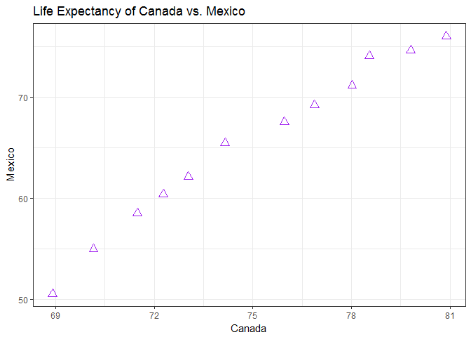
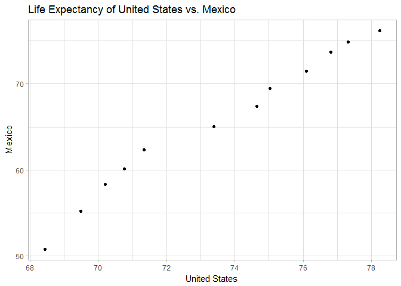

# hw-04
Melanie Ang  
October 3, 2017  

# Homework 04: Tidy data and joins aka Data wrangling
In this week's homework we combine what we've learned about dplyr (joins, select, filter etc.). See **my tips** sprinkled through this files for some fun facts I've learned in the process.


## Choose your own adventure: let the fun begin!

There are 2 main topics we cover in this week's homework:
* Data reshaping
* Joins


```r
library(tidyverse)
library(tidyr) # fun fact: tidyr is part of the tidyverse packages so this step is completely unneccessary!
library(gapminder)
library(knitr)
library(kableExtra)
```

### Data reshaping

I'm really liking trinker's cheatsheet! I won't be creating my own in this homework so I'm linking it here for my future reference:   
[tidyr in a nutshell](https://github.com/trinker/tidyr_in_a_nutshell) and [dplyr in a nutshell](https://github.com/trinker/dplyr_in_a_nutshell).

* As a quick summary for myself, tidyr::gather takes wide data frame and make it long aka **expand down rows**.   
* While tidyr::spread takes long data frames and make it wide aka **expand across columns**.

### Activity 2: Make a tibble with one row per year and columns for life expectancy for two or more countries.

I'm selecting North America (Canada, Mexico and USA)

```r
p <- gapminder %>%
  filter(country %in% c("Canada", "Mexico", "United States")) %>% # filter countries
  select(country, year, lifeExp) %>% # selecting only what we need to work with
  spread(country, lifeExp)

p %>% # make countries column, each value is lifeExp
  kable(format = 'markdown', digits = 2, align = "c", caption = "Life Expectancy in North America by Country")
```


| year | Canada | Mexico | United States |
|:----:|:------:|:------:|:-------------:|
| 1952 | 68.75  | 50.79  |     68.44     |
| 1957 | 69.96  | 55.19  |     69.49     |
| 1962 | 71.30  | 58.30  |     70.21     |
| 1967 | 72.13  | 60.11  |     70.76     |
| 1972 | 72.88  | 62.36  |     71.34     |
| 1977 | 74.21  | 65.03  |     73.38     |
| 1982 | 75.76  | 67.41  |     74.65     |
| 1987 | 76.86  | 69.50  |     75.02     |
| 1992 | 77.95  | 71.45  |     76.09     |
| 1997 | 78.61  | 73.67  |     76.81     |
| 2002 | 79.77  | 74.90  |     77.31     |
| 2007 | 80.65  | 76.19  |     78.24     |

Let's scatterplot this!
This is easier to acheieve after the spread function because each country is in its own column and can be plotted against each other.  


```r
gapminder %>%
  filter(country %in% c("Canada", "Mexico", "United States")) %>% 
  select(country, year, lifeExp) %>% 
  spread(country, lifeExp) %>% # repeat of code above
  ggplot() +
  geom_jitter(aes(x = Canada, y = Mexico), size = 3, shape = 2, colour = "purple") +
  labs(title = "Life Expectancy of Canada vs. Mexico") +
  theme_bw() 
```

<!-- -->

**TIP1: In plotting these, I wondered the difference between geom_point and geom_jitter as both gave me (what appeared to be) the same plot! Upon [stack overflowing](https://stackoverflow.com/questions/39255781/what-is-difference-between-geom-point-and-geom-jitter-in-simple-language-in-r), I found out that jittering spreads out points that are otherwise too closely plotted together/overplotted. In this case, because I have very few points, I proceed to using geom_point()**


```r
gapminder %>%
  filter(country %in% c("Canada", "Mexico", "United States")) %>% 
  select(country, year, lifeExp) %>% 
  spread(country, lifeExp) %>% # repeat of code above
  ggplot() +
  geom_point(aes(x = `United States`, y = Mexico)) +
  theme_light() +
  ggtitle("Life Expectancy of United States vs. Mexico") 
```

<!-- -->

**TIP 2: Interestingly because the word, United States is separated by a space, I cannot simply set aes(x=United States), it needs to be surrounded by (` `) NOT ' ' or " " - the latter two calls United States as an object instead of a column within the modified gapminder data frame**

For the fun of it, I'll use gather to move the data back to its original form (long format), even though by piping I haven't actually changed the original dataset.

```r
gapminder %>%
  filter(country %in% c("Canada", "Mexico", "United States")) %>% 
  select(country, year, lifeExp) %>% 
  spread(country, lifeExp) %>%
  gather(country, lifeExp, -c(year)) %>% # gather all except for year
  knitr::kable(align = "c", format = "markdown", digits = 2) 
```


| year |    country    | lifeExp |
|:----:|:-------------:|:-------:|
| 1952 |    Canada     |  68.75  |
| 1957 |    Canada     |  69.96  |
| 1962 |    Canada     |  71.30  |
| 1967 |    Canada     |  72.13  |
| 1972 |    Canada     |  72.88  |
| 1977 |    Canada     |  74.21  |
| 1982 |    Canada     |  75.76  |
| 1987 |    Canada     |  76.86  |
| 1992 |    Canada     |  77.95  |
| 1997 |    Canada     |  78.61  |
| 2002 |    Canada     |  79.77  |
| 2007 |    Canada     |  80.65  |
| 1952 |    Mexico     |  50.79  |
| 1957 |    Mexico     |  55.19  |
| 1962 |    Mexico     |  58.30  |
| 1967 |    Mexico     |  60.11  |
| 1972 |    Mexico     |  62.36  |
| 1977 |    Mexico     |  65.03  |
| 1982 |    Mexico     |  67.41  |
| 1987 |    Mexico     |  69.50  |
| 1992 |    Mexico     |  71.45  |
| 1997 |    Mexico     |  73.67  |
| 2002 |    Mexico     |  74.90  |
| 2007 |    Mexico     |  76.19  |
| 1952 | United States |  68.44  |
| 1957 | United States |  69.49  |
| 1962 | United States |  70.21  |
| 1967 | United States |  70.76  |
| 1972 | United States |  71.34  |
| 1977 | United States |  73.38  |
| 1982 | United States |  74.65  |
| 1987 | United States |  75.02  |
| 1992 | United States |  76.09  |
| 1997 | United States |  76.81  |
| 2002 | United States |  77.31  |
| 2007 | United States |  78.24  |

# Join, merge, look up

For joins, merge etc - I found Jenny Bryan's [cheatsheet](http://stat545.com/bit001_dplyr-cheatsheet.html) useful and also the [R Studio data wrangling cheatsheet](https://www.rstudio.com/wp-content/uploads/2015/02/data-wrangling-cheatsheet.pdf).

### Activity #2: Create your own cheatsheet
Honestly, I'm a bit sick of working with the gapminder dataset, so I will take this opportunity to create my own cheatsheet to illustrate the different types of joins. Plus also make it (somewhat) relevant to my thesis about fish!

In order to keep things organized, I've created my cheatsheet in a seperate R script. [Click here](https://github.com/angmelanie/STAT545-hw-Ang-Melanie/blob/master/hw-04/homework-04-join-cheatsheet.md) to access my join cheatsheet!

