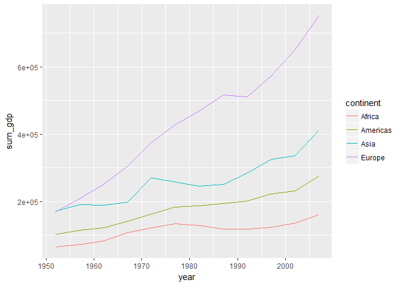
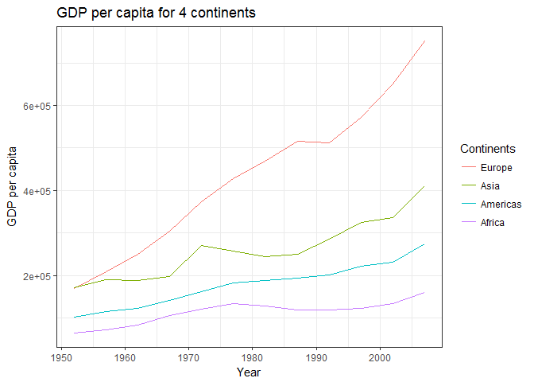
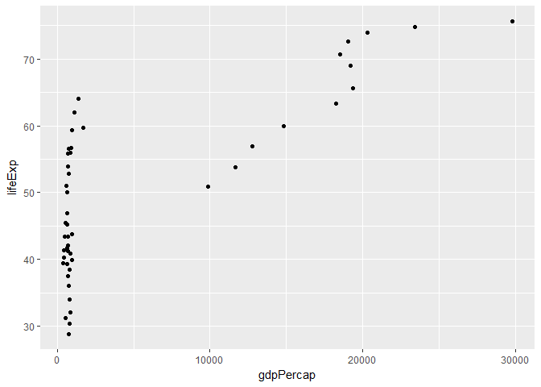
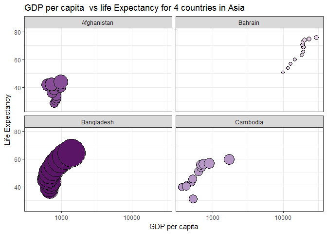

# hw-05
Melanie Ang  
October 11, 2017  
# Melanie's homework 5

[Click](http://stat545.com/hw05_factor-figure-boss-repo-hygiene.html) to view Homework 05 assignment on STAT545 website

Load packages:

```r
install.packages("tidyverse")
library(tidyverse)
library(forcats)
library(gapminder)
```


## Gapminder version
## Factor Management

### 1. Drop Oceania

```r
# BEFORE
dim(gapminder) # 1704 rows, 6 columns 
```

```
## [1] 1704    6
```

```r
str(gapminder) # continent has 5 levels 
```

```
## Classes 'tbl_df', 'tbl' and 'data.frame':	1704 obs. of  6 variables:
##  $ country  : Factor w/ 142 levels "Afghanistan",..: 1 1 1 1 1 1 1 1 1 1 ...
##  $ continent: Factor w/ 5 levels "Africa","Americas",..: 3 3 3 3 3 3 3 3 3 3 ...
##  $ year     : int  1952 1957 1962 1967 1972 1977 1982 1987 1992 1997 ...
##  $ lifeExp  : num  28.8 30.3 32 34 36.1 ...
##  $ pop      : int  8425333 9240934 10267083 11537966 13079460 14880372 12881816 13867957 16317921 22227415 ...
##  $ gdpPercap: num  779 821 853 836 740 ...
```

```r
# AFTER
gapminder_nooceania <- gapminder %>%
  filter(continent != "Oceania")
dim(gapminder_nooceania) # 1680 rows, 6 columns
```

```
## [1] 1680    6
```

```r
unique(gapminder_nooceania$continent) # 4 unique items
```

```
## [1] Asia     Europe   Africa   Americas
## Levels: Africa Americas Asia Europe Oceania
```

```r
str(gapminder_nooceania) # but continent still has 5 levels even though we dropped oceania
```

```
## Classes 'tbl_df', 'tbl' and 'data.frame':	1680 obs. of  6 variables:
##  $ country  : Factor w/ 142 levels "Afghanistan",..: 1 1 1 1 1 1 1 1 1 1 ...
##  $ continent: Factor w/ 5 levels "Africa","Americas",..: 3 3 3 3 3 3 3 3 3 3 ...
##  $ year     : int  1952 1957 1962 1967 1972 1977 1982 1987 1992 1997 ...
##  $ lifeExp  : num  28.8 30.3 32 34 36.1 ...
##  $ pop      : int  8425333 9240934 10267083 11537966 13079460 14880372 12881816 13867957 16317921 22227415 ...
##  $ gdpPercap: num  779 821 853 836 740 ...
```

```r
# FACTOR COUNT
# Oceania is still present in both as a factor!
forcats::fct_count(gapminder$continent) # BEFORE Oceania - 24
```

```
## # A tibble: 5 x 2
##          f     n
##     <fctr> <int>
## 1   Africa   624
## 2 Americas   300
## 3     Asia   396
## 4   Europe   360
## 5  Oceania    24
```

```r
fct_count(gapminder_nooceania$continent) # AFTER Oceania - 0
```

```
## # A tibble: 5 x 2
##          f     n
##     <fctr> <int>
## 1   Africa   624
## 2 Americas   300
## 3     Asia   396
## 4   Europe   360
## 5  Oceania     0
```

```r
# Drop levels - drop Oceania
# We see that the data frame still contains 5 levels instead of 4 even though we dropped Oceania
nlevels(gapminder_nooceania$continent)
```

```
## [1] 5
```

```r
# TWO METHODS
# We can use droplevels() but will operate on all factors
g_nooceania_dropped <- gapminder_nooceania %>% 
  droplevels()
nlevels(g_nooceania_dropped$continent)
```

```
## [1] 4
```

```r
# Or we can use forcats::fct_drop()
g_nooceania_dropped_two <- gapminder_nooceania$continent %>% 
  fct_drop() %>% 
  levels()

# FACTOR COUNT
fct_count(g_nooceania_dropped$continent) # Oceania is dropped as a factor
```

```
## # A tibble: 4 x 2
##          f     n
##     <fctr> <int>
## 1   Africa   624
## 2 Americas   300
## 3     Asia   396
## 4   Europe   360
```

```r
fct_count(g_nooceania_dropped_two) # AFTER is dropped as a factor
```

```
## # A tibble: 4 x 2
##          f     n
##     <fctr> <int>
## 1   Africa     1
## 2 Americas     1
## 3     Asia     1
## 4   Europe     1
```

### 2. Reorder the levels of country or continent

We are going to work from the dropped factor Oceania data frame (g_nooceania_dropped)

We will inspect the current order of the continents column and reorder the factor levels based on: frequency of continents column and then based on the quantitative variable GDP per cap.


```r
# current order is alphabetical
g_nooceania_dropped$continent %>% 
  levels()
```

```
## [1] "Africa"   "Americas" "Asia"     "Europe"
```

```r
# change order by frequency
g_nooceania_dropped$continent %>% 
  fct_infreq() %>% 
  levels()
```

```
## [1] "Africa"   "Asia"     "Europe"   "Americas"
```

```r
# reorder the continents by median gdp per cap
g_nooceania_dropped$continent %>% 
  fct_reorder(g_nooceania_dropped$gdpPercap) %>% 
  levels()
```

```
## [1] "Africa"   "Asia"     "Americas" "Europe"
```

```r
# reorder the continents by GDP per cap (lowest GDP per cap first)
g_nooceania_dropped$continent %>% 
  fct_reorder(g_nooceania_dropped$gdpPercap, min) %>% 
  levels()
```

```
## [1] "Africa"   "Asia"     "Europe"   "Americas"
```

```r
# flip order so highest GDP continent appears first
g_nooceania_dropped$continent %>% 
  fct_reorder(g_nooceania_dropped$gdpPercap, .desc = TRUE) %>% 
  levels()
```

```
## [1] "Europe"   "Americas" "Asia"     "Africa"
```

### I can also read and write files


```r
write_csv(g_nooceania_dropped, "~/practice-write-file")
g_nooceania_dropped_read <- read_csv("~/practice-write-file")
```

### Exploration - Now I will characterize the data before I change the order of the levels


```r
# Table view - it is displayed alphabetically by continent
g_nooceania_dropped %>% 
  group_by(continent, year) %>% 
  summarize(sum_gdp = sum(gdpPercap)) %>% 
  head()
```

```
## Source: local data frame [6 x 3]
## Groups: continent [1]
## 
## # A tibble: 6 x 3
##   continent  year   sum_gdp
##      <fctr> <int>     <dbl>
## 1    Africa  1952  65133.77
## 2    Africa  1957  72032.28
## 3    Africa  1962  83100.10
## 4    Africa  1967 106618.92
## 5    Africa  1972 121660.02
## 6    Africa  1977 134468.80
```

```r
# This is the original ggplot by alphabetical order
g_nooceania_dropped %>% 
  group_by(continent, year) %>% 
  summarize(sum_gdp = sum(gdpPercap)) %>% 
  ggplot(aes(x = year, y = sum_gdp)) +
  geom_line(aes(colour = continent))
```

<!-- -->


```r
# We use the arrange function - which changes the data frame, orders in descending order by GDP
g_nooceania_dropped %>% 
  group_by(continent, year) %>% 
  summarize(sum_gdp = sum(gdpPercap)) %>% 
  arrange(desc(sum_gdp)) %>% 
  head()
```

```
## Source: local data frame [6 x 3]
## Groups: continent [1]
## 
## # A tibble: 6 x 3
##   continent  year  sum_gdp
##      <fctr> <int>    <dbl>
## 1    Europe  2007 751634.4
## 2    Europe  2002 651352.0
## 3    Europe  1997 572303.5
## 4    Europe  1987 516429.3
## 5    Europe  1992 511847.0
## 6    Europe  1982 468536.9
```

```r
# But when we ggplot it, it goes back to the original order
g_nooceania_dropped %>% 
  group_by(continent, year) %>% 
  summarize(sum_gdp = sum(gdpPercap)) %>% 
  arrange(desc(sum_gdp))%>% 
  ggplot(aes(x = year, y = sum_gdp)) +
  geom_line(aes(colour = continent))
```

<!-- -->


```r
# Reordering based on the order of highest GDP per cap to lowest
# I'm using fct_reorder2 because I have quantitative vs. quantitative
# If it was qualitative vs quantitative - use fct_reorder()

g_nooceania_dropped %>% 
  group_by(continent, year) %>% 
  summarize(sum_gdp = sum(gdpPercap)) %>% 
  arrange(desc(sum_gdp))%>% 
  ggplot(aes(x = year, y = sum_gdp, colour = fct_reorder2(continent, year, sum_gdp))) +
  geom_line() +
  scale_colour_discrete(name = "Continents") +
  theme(legend.position = "bottom") +
  labs(title = "GDP per capita for 4 continents", x = "Year", y = "GDP per capita") +
  theme_bw()
```

<!-- -->

### I can also read and write files, this time I try using TSV


```r
write_tsv(g_nooceania_dropped, "~/practice-write-file")
g_nooceania_dropped_read <- read_tsv("~/practice-write-file")
```


## Visualizations

I will make a figure of gdp per capita and life expectancy


```r
g_nooceania_dropped %>%
  filter(country %in% c("Afghanistan", "Bahrain", "Bangladesh", "Cambodia")) %>% 
  ggplot(aes(x = gdpPercap, y = lifeExp))+
  geom_point() 
```

<!-- -->

I will remake it now based on what I've learned in class

```r
g_nooceania_dropped %>%
  filter(country %in% c("Afghanistan", "Bahrain", "Bangladesh", "Cambodia")) %>% 
  ggplot(aes(x = gdpPercap, y = lifeExp))+
  geom_point(aes(size = pop), pch = 21, show.legend = FALSE) +
  scale_size_continuous(range = c(2, 20)) +
  scale_x_log10() +
  facet_wrap(~ country) +
  ylim(c(25,80)) +
  aes(fill = country) +
  scale_fill_manual(values = country_colors) +
  labs(title = "GDP per capita  vs life Expectancy for 4 countries in Asia", x = "GDP per capita", y = "Life Expectancy") +
  theme_bw()
```

<!-- -->

Writing figures to files using ggsave

```r
ggsave("gdp-lifeexp-af-bah-ban-ca.png")
```

```
## Saving 7 x 5 in image
```


```r
ggsave("gdp-lifeexp-af-bah-ban-ca.png", scale = 2) 
# playing around with scale
# scale > 1 plot elements will be smaller compared to plot

[Heres the figure I created above]("~/gdp-lifeexp-af-bah-ban-ca.png")
```
Interestingly, I try to embed the figure with the code above in the RMarkdown (non code chunk), but I keep getting an error message. Not sure why, anyone else getting this error?


## To wrap this all up
Please find my reflection in my README for homework 5. Also resources I've used that have significantly help are:

[STAT 545 - FACTORS](http://stat545.com/block029_factors.html)  
[STAT 545 - using bubble charts in ggplot](http://stat545.com/block019_enforce-color-scheme.html)  
[STAT 545 - happy graphing life](http://stat545.com/block016_secrets-happy-graphing.html)  
[STAT 545 - write files](http://stat545.com/block017_write-figure-to-file.html)
